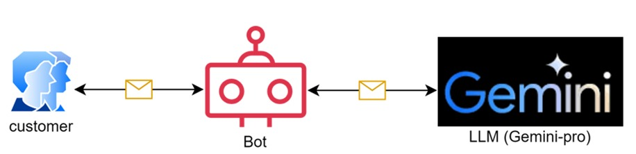

<h1>Burger Bot 🍔🤖</h1>

Welcome to the Burger Bot repository! This project is a chatbot designed to assist with ordering burgers. The bot is built using Gradio and the Gemini API, and includes a Colab file with the code.

<h2> Demo Video </h2>
Watch the demo video to see Burger bot in action:

<h2>Features</h2>

* User-friendly Interface: Easy-to-use interface powered by Gradio.
* Order Management: Helps users order burgers efficiently.
* Interactive Demo:  Try the bot directly via the included Colab file.
* Demo Video: Watch the bot in action with our demo video.

<h2>Technologies Used</h2>

  1. Python
  2. Gemini
  3. Gradio
  4. Colab

<h2>High level architecture diagram</h2>

<h1> Getting Started </h1>

</h2>Installation:</h2>

1. Clone the repository:

   `git clone https://github.com/edquestofficial/Burget-Bot `
   
   `cd burger-bot`

2. Virtual environment:
   
   `python -m venv venv  `
   
  Windows :    `venv\Scripts\activate  `
  
  Mac\Linux:   `source myenv/bin/activate` 

3. Install the required packages:
   
   `pip install -r requirements.txt`

4. Create a .env file in the root directory of the project and define your Gemini API key:

   `echo GEMINI_API_KEY=your_api_key_here > .env`

<h2> Running the Bot </h2>

To start the bot, run the following command:

`python app.py`
   
<h2>Demo View</h2>

<h2> Feedback/ Query Form </h2>

share any query or feedback in this google form: [Feedback Form](https://forms.gle/EVLTwUMsdtiidKkR9)
